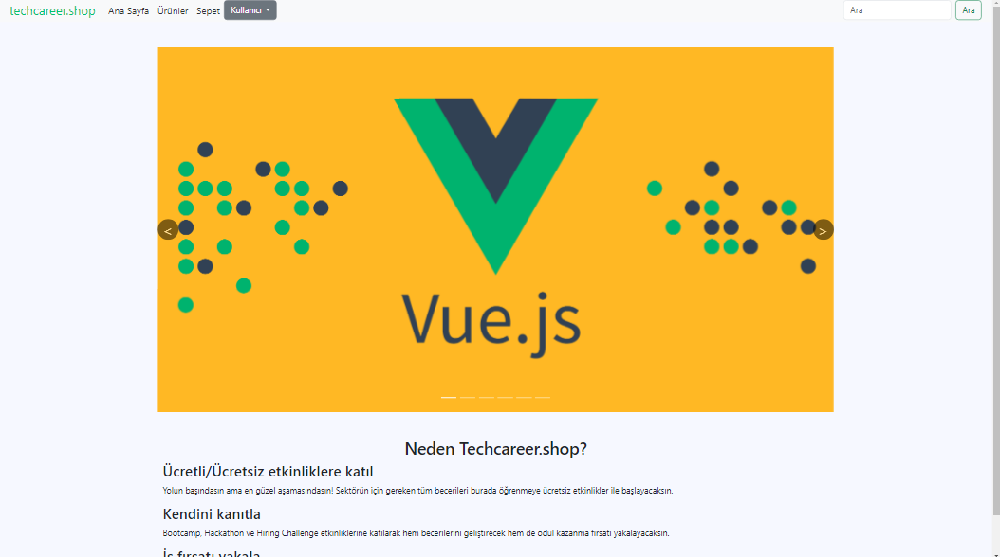
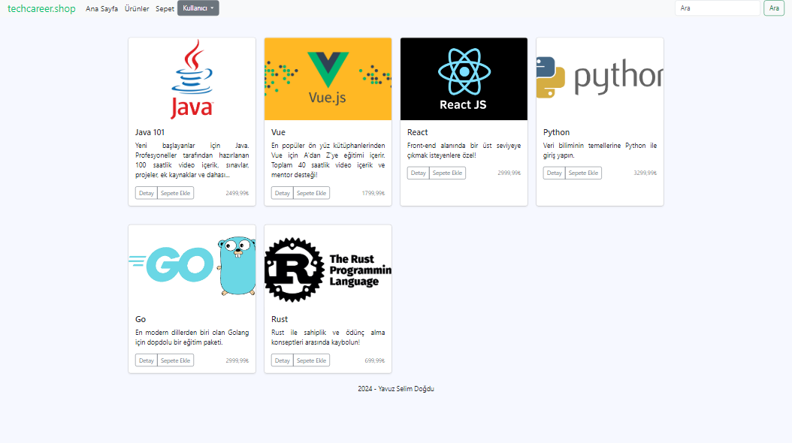
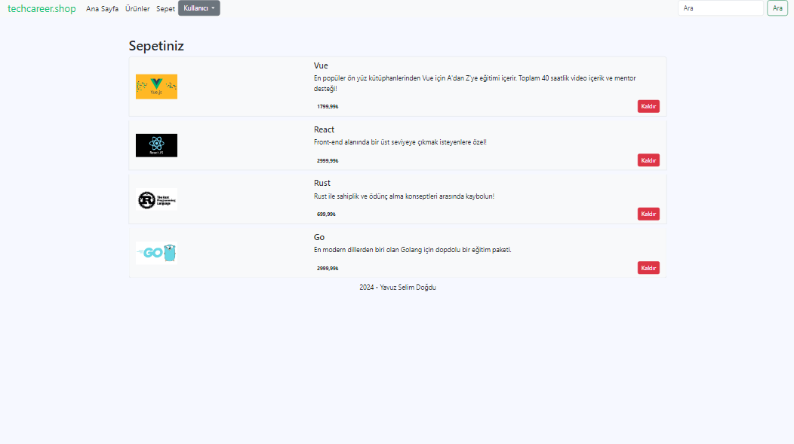
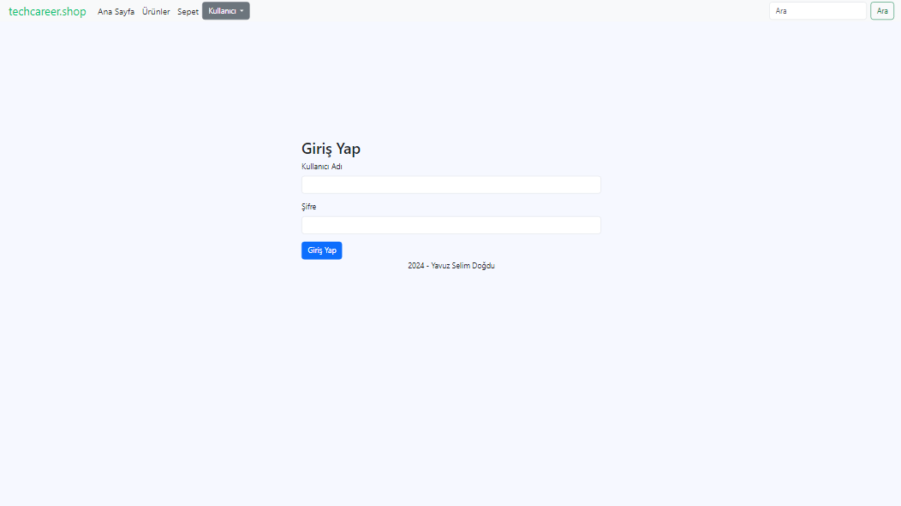

# techcareer.shop

Techcareer - The Frontend Expedition: Vue.js Bootcamp Project

### Gereksinimler

- [Node.js](https://nodejs.org/en/)

### Kurulum

Proje dizininde node modüllerini kurun:

```
npm install
```

Vue projesini başlatın:

```
npm run serve
```

### Ekran Görüntüleri






- Yavuz Selim Doğdu
